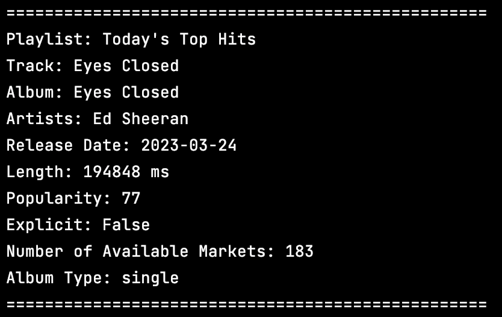

# spotify-hitsongs

Sparsh Gupta and Sohum Kothavade

## Project Description

In this project, we explore how certain non-musical factors, for example, release date of songs, album, etc. are correlated to the 'popularity' of a song and how these factors affect the successfulness of a song. To do this, we used Spotify's API to obtain data from ['The Million Playlist'](https://research.atspotify.com/2020/09/the-million-playlist-dataset-remastered/) dataset. We process this data to extract statistics for the non-musical factors being considered in this study and use visualizations to understand how these are related to the 'popularity' of a song.


For understanding this project thouroughly, please access the computational essay 
`spotify-hitsongs.ipynb` included in this repository.

## Dependencies

| Package   | Uses            |
|-----------|-----------------|
| Matplotlib| Visualization   |
| NumPy     | Random Sampling |
| Pandas    | Data Processing |
| Requests  | Web Requests    |
| SpotiPy   | Spotify API     |

 The dependencies are present in `requirements.txt` and can be installed using the following in terminal/command prompt (make sure to have your present working directory as this repo):
 
 ```
 pip install -r requirements.txt
 ```
 
## Data

The data used in this study is from Spotify's ['The Million Playlist'](https://research.atspotify.com/2020/09/the-million-playlist-dataset-remastered/) dataset. We obtained the data used in this study from Spotify's API which gives us access to a million playlists of songs consisting of more than a hundred million songs/tracks.

The sample extracted data output can be seen below:



## API Access

We obtain the web API access keys which includes `CLIENT_ID` and `CLIENT_SECRET` from [Spotify Developer Tools](https://developer.spotify.com) by creating a developer account and a project.

If you would like to authorize into your Spotify User Account before extracting the API data (recommended), you can use the module `spotifyrequests.py` and enter your `CLIENT_ID` and `CLIENT_SECRET`. If the request to authorize the account succeeds, you will be outputted an alphanumeric API access token. If you want to access the API data without user authorization (not recommended), you can skip this step.

Once you obtain the `CLIENT_ID` and `CLIENT_SECRET`, enter the keys in `spotify_api_keys.py` inside the appropriate functions

We use the following functions from `spotify_api_keys.py` (private file) to access the API keys stored in this via the following functions:

```
CLIENT_ID = get_client_id()
CLIENT_SECRET = get_client_secret()
```
## Code Execution

To run the code in this repo, please clone this repo to your local machine and run `main.py` in either a Python-compatible IDE or if using a terminal/command prompt (make sure to have your present working directory as this repo):

```
python3 main.py
```

Executing `main.py` will automatically extract the dataset, process it, and generate visualizations provided the above API Access is completed correctly.

## Data Extraction & Processing

We used the module `spotifydata.py` to extract data from Spotify's web API using the following function.

```
get_spotify_data(CLIENT_ID, CLIENT_SECRET)
```

The above function also processes the dataset accessed through the API and stores it to the csv file `data.csv`

## Visualization

The visualizations for this project are created using the following function from the module `visualizations.py`

```
create_visualizations('data.csv', 'figures')
```

The function uses the data file `data.csv` to generate visualizations and stores the visualizations in the directory `figures`

## Unit Tests

The unit tests for this project tests the code for functions `get_spotify_data()` and `create_visualizations()` in the module `spotify_hit_songs_test.py`
